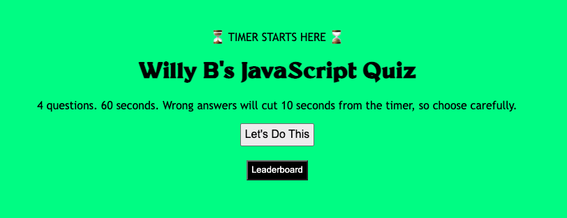

# Willy B's JavaScript Quiz

This challenge was something else but ultimately a great addition to my portfolio.

Although I had started using JavaScript in a previous project, leveraging its features to create a quiz from scratch really threw me for a loop.

I had to go back to basics and remember that every step of my process had to be informed by a user decision: to click or not to click.

Pseudocoding steps in advance and assigning IDs to different divs and elements within the HTML enabled me to establish global variables at the top of my .js file.

Then came the dance between functions and event listeners to attach displayed pages + buttons to behaviors and subsequent pages + buttons.

Learning how to get and display data from local storage was also a pretty interesting part of this particular ask.

As specified in the Challenge Acceptance Criteria, the quiz achieves the following:

✨ After clicking "Let's Do This", a timer starts and the first question is displayed.

✨ When one question is answered, another question is displayed.

✨ Incorrect answers subtract 10 seconds from the clock.

✨ The game is over when all questions are answered or the timer reaches 0.

✨ The score is displayed and can be saved along with initials when the game is over.

Below is a screenshot of my latest and greatest:

To test your JavaScript knowledge, visit https://willbrennana.github.io/04_code-quiz/
